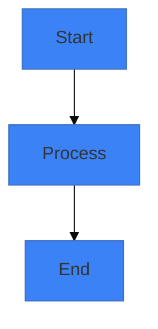

# Visual Enhancement Workflow

Analyze all slides and provide interactive visual enhancement with diagrams, images, and AI prompts using evidence-based best practices.

**Evidence Base**: Visual enhancements follow research-based principles for cognitive load, accessibility, and effective communication. See `references/presentation-best-practices.md` for guidelines.

## Execution

### 1. Read Slides

Find and parse slides.md:
- Count total slides
- Identify slides with existing visuals
- Find slides with visual placeholders
- Detect slides that need visuals

### 2. Analyze Visual Opportunities (Evidence-Based)

Use visual-suggester agent to identify slides needing visuals based on:
- **One idea per slide**: Does visual support the single central message?
- **Cognitive load**: Will visual + text + bullets stay ≤6 total elements?
- **Visual over text**: Can diagram replace text-heavy explanations?
- **Accessibility**: Can visual work with colorblind-safe colors?

```
Analyze all slides using visual-suggester agent to identify visual enhancement opportunities.
```

Agent returns prioritized list of slides needing visuals.

### 3. Present Overview

Show user the analysis:
```markdown
## Visual Enhancement Analysis

**Slides Analyzed:** [X] total

**Visual Opportunities Found:**

### High Priority (Needs Visual)
- Slide 3: [Title] - [Why visual needed]
- Slide 7: [Title] - [Why visual needed]
- Slide 12: [Title] - [Why visual needed]

### Medium Priority (Would Benefit)
- Slide 5: [Title] - [Optional enhancement]
- Slide 9: [Title] - [Optional enhancement]

### Low Priority (Already Good)
- Slide 1: [Title] - [Already has visual]
- ...

**Recommendation:** Focus on [N] high-priority slides.

Should we enhance all high-priority slides, or would you like to select specific ones?
```

### 4. Interactive Selection Mode

For each slide to enhance (based on user choice):

**Present Options:**
```markdown
---
## Slide [N]: [Title]

**Current State:**
[Brief content summary]
[X] words, [Y] bullets, [Z] visuals
**Element count:** [Total elements] (target: ≤6)

**Visual Options:**

### Option 1: Mermaid Flowchart ⚡

**Why this works:**
[Explanation of how diagram supports slide's ONE IDEA]

**Evidence-based design:**
- Max 7-9 nodes (cognitive load research: working memory limit)
- Colorblind-safe theme colors applied
- Supports slide assertion without overloading

**Diagram Code:**
```mermaid
%%{init: {'theme':'base', 'themeVariables': {
  'primaryColor':'#3b82f6',
  'secondaryColor':'#f97316',
  'lineColor':'#6b7280'
}}}%%
[Complete working mermaid code with colorblind-safe theme colors]
```

**Element count check:** Diagram counts as 1 element. Current slide total: [X] elements (target: ≤6)

**Preview:** Inline rendering (Slidev handles) or offline high-quality?

---

### Option 2: Mermaid Sequence Diagram ⚡

[Alternative diagram approach]

```mermaid
[Alternative code]
```

---

### Option 3: Stock Photo 📷

**Search Terms:**
- "[Primary term]"
- "[Alternative term]"

**Suggested Images:**
1. [Specific photo description] - Unsplash
   https://unsplash.com/photos/[id]

2. [Alternative description] - Pexels
   https://www.pexels.com/photo/[id]

**Usage:** image-right layout or background (30% opacity)?

---

### Option 4: AI-Generated Image 🎨

**DALL-E 3 Prompt:**
```
[Detailed, well-structured prompt]
```

**Midjourney Prompt:**
```
/imagine [prompt] --ar 16:9 --v 6 --style raw
```

**Stable Diffusion:**
```
Positive: [prompt]
Negative: [negative]
```

**To use:** Generate image, save to `public/images/`, reference in slide.

---

**Which option for Slide [N]?**
1. Mermaid Option 1 (flowchart)
2. Mermaid Option 2 (sequence)
3. Stock Photo (I'll provide URL)
4. AI Image (save prompts for later)
5. Skip this slide
```

### 5. Implement Chosen Option

Based on user choice:

**Mermaid Diagram:**
1. Ask: Inline or offline rendering?
2. If inline: Add diagram code directly to slide
3. If offline:
   - Save diagram code to temp file
   - Run render script if mermaid-cli available
   - Add image reference to slide

Example edit:
```markdown
# Slide Title

Content here


```

**Stock Photo:**
1. Ask user: "Provide the image URL you chose"
2. Download image:
   ```bash
   ${CLAUDE_PLUGIN_ROOT}/scripts/download-image.sh [URL] public/images
   ```
3. Update slide with image reference:
   ```markdown
   ---
   layout: image-right
   image: './public/images/[filename]'
   ---
   ```

**AI Image:**
1. Save prompts to `ai-image-prompts.md`:
   ```markdown
   ## Slide [N]: [Title]

   ### DALL-E 3
   ```
   [prompt]
   ```

   ### Midjourney
   ```
   [prompt]
   ```

   ### Stable Diffusion
   ```
   Positive: [prompt]
   Negative: [negative]
   ```

   **To use:**
   1. Generate image with service of choice
   2. Save as `public/images/slide-[N]-[description].png`
   3. Update slide: `image: './public/images/slide-[N]-[description].png'`
   ```

2. Add placeholder to slide:
   ```markdown
   <!-- TODO: Add AI-generated image
   See ai-image-prompts.md for prompts
   Filename: slide-[N]-[description].png
   -->
   ```

### 6. Track Progress

Update user after each slide:
```markdown
✅ Slide [N] enhanced with [option type]

Progress: [X] of [Y] slides enhanced
```

### 7. Theme Consistency Check

After enhancements, verify:
- All mermaid diagrams use same theme colors
- Images match visual style
- Layouts are consistent
- No jarring transitions

### 8. Final Summary

Present completion:
```markdown
## ✅ Visual Enhancement Complete!

**Slides Enhanced:** [X] of [Y]

**Enhancements Added:**
- Mermaid diagrams: [N] slides
- Stock photos: [M] slides
- AI image prompts saved: [P] slides
- Skipped: [Q] slides

**Files Updated:**
- `slides.md` - Diagrams and images added
- `ai-image-prompts.md` - Prompts for [P] images

**Next Steps:**

1. **Generate AI images** (if any):
   - Open `ai-image-prompts.md`
   - Use DALL-E/Midjourney/SD to generate
   - Save to `public/images/`
   - Update slide references

2. **Preview updated slides:**
   ```bash
   cd [presentation-dir]
   slidev slides.md
   ```

3. **Download stock photos** (if pending):
   - URLs are in comments
   - Or I can download them now

4. **Export final version:**
   `/slidedeck:export pdf`

**Visual Theme:**
- Colors: [Primary], [Secondary], [Accent]
- Style: [Consistent/Modern/Professional]
- All diagrams themed consistently ✓
```

## Batch vs Individual Mode

**Batch Mode** (default):
- Analyze all slides first
- Show prioritized list
- User selects which to enhance
- Process selected slides

**Individual Mode:**
- Ask: "Process slides one-by-one or show all opportunities first?"
- If one-by-one: Present each slide, get decision, move to next
- If all: Batch mode above

## Visual Theme Management

Extract or establish theme:
```yaml
Colors:
  primary: "#3b82f6"    # From settings or slides
  secondary: "#8b5cf6"
  accent: "#f59e0b"

Style: modern-minimal  # From settings or infer
```

Apply to all mermaid diagrams and suggest for images.

## Error Handling

**Mermaid rendering fails:**
- Fall back to inline
- Provide code anyway
- User can render manually at mermaid.live

**Image download fails:**
- Save URL in comment
- User can download manually
- Offer alternative image

**Too many options overwhelming:**
- Limit to top 2-3 options
- Focus on most impactful
- Allow "use your best judgment" mode

## Evidence-Based Visual Selection Criteria

**Do add visuals when:**
- Slide is text-heavy (>50 words) and diagram can replace text
- Process/workflow/architecture needs visualization
- Data or statistics are being presented
- Slide lacks visual interest
- Abstract concept needs concrete representation

**Don't add visuals when:**
- Adding visual would exceed 6 total elements
- Slide is a bold statement/quote (visual competes)
- Current slide is already visually balanced
- Diagram would be too complex (>9 nodes)
- Visual doesn't directly support the slide's ONE idea

**Colorblind-Safe Palette (Applied to all diagrams):**
- Primary: Blue (#3b82f6) - 8.6:1 contrast
- Secondary: Orange (#f97316) - 3.4:1 (headings only)
- Neutral: Gray (#6b7280)
- Verified safe for deuteranopia, protanopia, tritanopia

## Tips

- **Start with high-priority slides** (those exceeding 50 words or lacking visuals)
- **Maintain consistent visual language** (same diagram style throughout)
- **Don't overdo it** (not every slide needs diagram - some work better as bold statements)
- **Enforce cognitive load limit** (each diagram + surrounding content ≤6 total elements)
- **Keep diagrams simple** (max 7-9 nodes per research)
- **Test colorblind-safe** (use ColorBrewer-verified palettes)
- **Preview before finalizing** (check actual rendering)
- **Save AI prompts** even if not using now

Inform user visual enhancement is complete!
