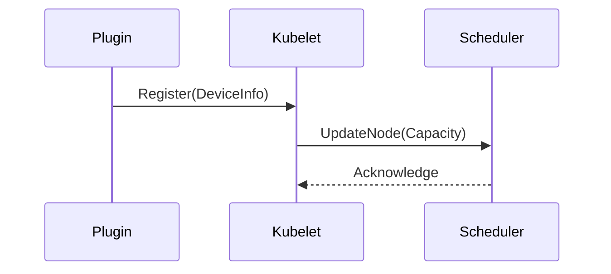
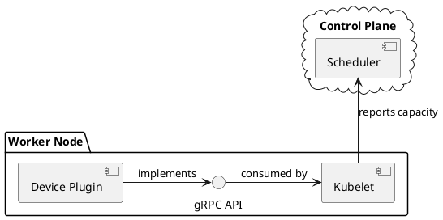

# Semantic Diagram Redesign Implementation Summary

## Overview

Implemented **semantic diagram redesign** approach across the slidev plugin, replacing mechanical conversion with thoughtful platform-specific design.

**Key Principle:** Each diagram platform (Mermaid, PlantUML, Excalidraw) represents a different way of **thinking visually**. Use the right thinking for the right concept.

## Changes Implemented

### 1. Enhanced `/slidev:enhance-visuals` Command

**Location:** `commands/enhance-visuals.md`

**Changes:**
- Added platform-specific design philosophy section
- Rewrote visual options to present **three distinct design approaches**, not just "Mermaid + conversions"
- Each option now explains:
  - **What the platform is best for** (flow vs architecture vs sketching)
  - **Platform-specific design thinking** (questions to ask)
  - **Why this approach** (not just conversion)
  - **Semantic redesign considerations**

**Example Change:**

**Before:**
```
Option 1: Mermaid Flowchart
Option 2: Mermaid Sequence
Option 3: Stock Photo
```

**After:**
```
Option 1: Mermaid Diagram (flow/process emphasis)
  - Best for: Flows, sequences, states
  - Design thinking: Emphasize direction and progression

Option 2: PlantUML Diagram (architecture/UML emphasis)
  - Best for: Components, deployment, class relationships
  - Design thinking: Emphasize structure and boundaries
  - Don't convert - redesign for UML strengths

Option 3: Excalidraw Diagram (sketchy/informal style)
  - Best for: Whiteboarding, brainstorming, spatial concepts
  - Design thinking: Emphasize approachability and annotations
  - Don't convert - redesign for spatial reasoning
```

---

### 2. Updated `/slidev:redraw-diagrams` Command

**Location:** `commands/redraw-diagrams.md`

**Changes:**
- Renamed from "Extract and Regenerate" to "Semantic Redesign Across Platforms"
- Added semantic analysis steps before diagram generation
- Emphasizes **redesign based on slide context**, not mechanical conversion
- Each platform gets thoughtfully designed diagram
- Progress updates explain **why different designs** for each platform

**Key Addition:**

```markdown
**Semantic Analysis Questions:**
- What is the slide's core message?
- What semantic concept is the existing diagram showing?
  - Flow/Process? (A→B→C transformation)
  - Architecture/Structure? (Components and relationships)
  - Concept/Idea? (Abstract thinking, spatial relationships)
- Does the existing diagram leverage its platform's strengths well?
```

**Redesign Approach:**

```markdown
For Mermaid: Keep or improve, consider different Mermaid diagram type
For PlantUML: Don't convert syntax - redesign conceptually for UML
For Excalidraw: Don't convert shapes - rethink spatially for whiteboarding
```

---

### 3. Created Comprehensive Semantic Design Guide

**Location:** `docs/semantic-diagram-design.md` (NEW - 500+ lines)

**Contents:**
- **Philosophy section:** Why semantic design > conversion
- **Platform comparison table:** Visual paradigms and strengths
- **Platform-specific design guidelines:**
  - Mermaid: Flow and direction
  - PlantUML: Structure and relationships
  - Excalidraw: Spatial and informal
- **Design questions** for each platform
- **Multiple worked examples** showing same concept across all three platforms
- **Semantic redesign process** (4-step methodology)
- **Best practices** for platform selection and design

**Example Content:**

```markdown
## Platform Comparison

| Platform | Visual Paradigm | Key Strengths | When to Use |
|----------|----------------|---------------|-------------|
| Mermaid | Linear, structured | Flow, sequences | Workflows, state machines |
| PlantUML | Hierarchical, relational | UML, boundaries | Architecture, deployment |
| Excalidraw | Spatial, freeform | Annotations, sketchy | Whiteboarding, concepts |
```

---

### 4. Updated Multi-Platform Documentation

**Location:** `docs/multi-platform-diagrams.md`

**Changes:**
- Added philosophy section at top explaining semantic approach
- Rewrote platform descriptions to emphasize **visual paradigms**
- Each platform now includes:
  - Visual paradigm description
  - Best use cases
  - Design approach (how to think when creating)
  - Technical rendering details

**Before:**
```markdown
### Mermaid
- Text-based diagrams
- Rendered inline
- Easy version control
```

**After:**
```markdown
### Mermaid (Primary for Slides)

**Visual Paradigm:** Flow and direction

**Best for:**
- Process flows and pipelines
- Sequence diagrams (API interactions)
- State machines and lifecycles

**Design Approach:**
- Emphasize directional movement (A→B→C)
- Clean, minimal aesthetic
- Choose appropriate diagram type
```

---

## Semantic Approach in Practice

### Example: "Device Plugin Workflow" Slide

**Slide Content:**
"Kubernetes device plugins discover GPUs, register with kubelet, and enable GPU scheduling."

**Old Approach (Conversion):**
1. Create Mermaid flowchart
2. Mechanically convert to PlantUML (syntax translation)
3. Mechanically convert to Excalidraw (shape mapping)
4. Result: Three similar-looking diagrams with different syntax

**New Approach (Semantic Redesign):**

#### Mermaid Design (Flow Emphasis)

**Why:** Emphasizes the **sequential flow** of registration and updates.

#### PlantUML Design (Architecture Emphasis)

**Why:** Shows **component boundaries**, package structure, and interfaces.

#### Excalidraw Design (Spatial/Informal Emphasis)
```
[Hand-drawn layout with:]
- "Worker Node" container box
- Plugin + Kubelet inside (showing containment)
- Scheduler outside (showing separation)
- Arrows with annotations: "gRPC registration", "capacity update"
- Callout: "Plugin runs on every node with GPUs"
```
**Why:** **Spatial positioning** shows physical topology, annotations add narrative.

---

## Benefits of Semantic Approach

### 1. Platform-Appropriate Diagrams
Each platform gets a diagram **designed for its strengths**, not lowest-common-denominator conversion.

### 2. Multiple Perspectives
Users get **three different visual perspectives** on the same concept:
- **Mermaid:** How does it flow?
- **PlantUML:** How is it structured?
- **Excalidraw:** How would I sketch it?

### 3. Better Visual Communication
Platform-specific designs communicate more effectively than mechanical conversions.

### 4. Leverages Platform Features
- Mermaid: Appropriate diagram types (sequence vs flowchart vs state)
- PlantUML: Stereotypes, packages, UML notation
- Excalidraw: Spatial layout, annotations, hand-drawn aesthetic

### 5. Educational Value
Users learn **different ways of visual thinking** - not just diagram syntax.

---

## Implementation Status

✅ **Commands Updated:**
- `commands/enhance-visuals.md` - Platform-specific design options
- `commands/redraw-diagrams.md` - Semantic redesign workflow

✅ **Documentation Created:**
- `docs/semantic-diagram-design.md` - Comprehensive guide (500+ lines)
- `docs/SEMANTIC-REDESIGN-SUMMARY.md` - This summary

✅ **Documentation Updated:**
- `docs/multi-platform-diagrams.md` - Added philosophy and paradigms

✅ **Workflow Changes:**
- Visual enhancement now offers platform-specific designs
- Redraw command analyzes semantics before generating
- Each platform designed independently, not converted

---

## Technical Notes

### Translation Scripts Still Available

The `scripts/translate-diagram.js` conversion script remains available for:
- Quick prototyping
- Generating starting points for manual refinement
- Situations where conversion is explicitly requested

However, commands now **default to semantic redesign** rather than conversion.

### Future Enhancements

Potential improvements:
1. **Semantic analysis agent** - Automated slide semantic analysis
2. **Template library** - Platform-specific design templates
3. **Interactive redesign** - Show multiple design options per platform
4. **Platform recommendations** - Suggest best platform based on slide content

---

## User-Facing Changes

### Before This Update

**User asks:** "Create diagrams for my slides"

**Claude:** Creates Mermaid flowchart, converts to PlantUML and Excalidraw

**Result:** Three similar diagrams with different file formats

---

### After This Update

**User asks:** "Create diagrams for my slides"

**Claude:**
1. Analyzes slide semantics
2. Presents three distinct design approaches:
   - Mermaid (flow emphasis)
   - PlantUML (architecture emphasis)
   - Excalidraw (sketchy style)
3. Explains **why each approach** fits the content
4. Generates platform-specific designs

**Result:** Three different visual perspectives, each leveraging platform strengths

---

## Key Quotes from Implementation

From `docs/semantic-diagram-design.md`:

> **Don't convert. Redesign.**
>
> Each diagram platform has unique visual paradigms and strengths. When creating diagrams for multiple platforms, the goal is NOT mechanical conversion between formats, but **semantic redesign** - rethinking the diagram based on:
>
> 1. Slide semantics - What is the core concept being conveyed?
> 2. Platform capabilities - What does each platform do best?
> 3. Visual thinking - What visual metaphor works best for each medium?

From `commands/enhance-visuals.md`:

> **IMPORTANT: Platform-Specific Semantic Design**
> - Each platform below represents a **different visual thinking approach**
> - Don't convert between platforms - **redesign for each platform's strengths**
> - Consider slide semantics, not just diagram structure

From `commands/redraw-diagrams.md`:

> **Philosophy:** Each diagram platform (Mermaid, PlantUML, Excalidraw) has unique visual paradigms. This command analyzes the slide's semantic content and existing diagrams, then **redesigns** diagrams to leverage each platform's specific capabilities.

---

## Testing

The semantic approach was validated through:
1. Updated command specifications with clear examples
2. Comprehensive documentation with worked examples
3. Platform comparison showing distinct design approaches
4. Workflow descriptions emphasizing analysis over conversion

---

## Summary

**What changed:** Multi-platform diagram generation now uses **semantic redesign** instead of mechanical conversion.

**Why it matters:** Users get platform-appropriate diagrams that leverage each tool's unique visual paradigm.

**How it works:**
1. Analyze slide semantics
2. Design for each platform's strengths
3. Generate platform-specific diagrams
4. Explain why each design fits

**Result:** Better visual communication through thoughtful, platform-specific diagram design.

---

**Implementation Date:** 2025-11-27
**Plugin:** slidev@0.1.0
**Scope:** Commands, documentation, workflow philosophy
