# Semantic Diagram Design: Platform-Specific Thinking

## Philosophy

**Don't convert. Redesign.**

Each diagram platform has unique visual paradigms and strengths. When creating diagrams for multiple platforms, the goal is NOT mechanical conversion between formats, but **semantic redesign** - rethinking the diagram based on:

1. **Slide semantics** - What is the core concept being conveyed?
2. **Platform capabilities** - What does each platform do best?
3. **Visual thinking** - What visual metaphor works best for each medium?

## Platform Comparison

| Platform | Best For | Visual Paradigm | Key Strengths | When to Use |
|----------|----------|-----------------|---------------|-------------|
| **Mermaid** | Flow, process, sequences | Linear, structured | Clean syntax, real-time rendering, developer-friendly | Workflows, pipelines, state machines, API flows |
| **PlantUML** | Architecture, UML, formal models | Hierarchical, relational | Rich UML notation, component boundaries, deployment contexts | System architecture, class relationships, deployment diagrams |
| **Excalidraw** | Sketches, brainstorming, informal | Spatial, freeform | Hand-drawn style, flexible positioning, annotations | Whiteboard sessions, conceptual thinking, informal explanations |

## Platform-Specific Design Guidelines

### Mermaid: Flow and Direction

**Visual Thinking:** "How does this move/transform/progress?"

**Strengths:**
- Directional flow (left-to-right, top-to-bottom)
- State transitions
- Sequential processes
- Time-based progressions

**Design Questions:**
1. What is the entry point and exit point?
2. What are the transformation steps?
3. Are there decision points or branches?
4. Is this better shown as a flowchart, sequence, or state diagram?

**Example Semantic Designs:**

#### Process-Oriented Slide
**Slide Content:** "Device plugins transform GPUs into schedulable Kubernetes resources"

**Mermaid Design (Flow emphasis):**
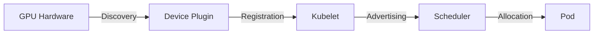

**Why Mermaid?** Emphasizes the **flow of information** from hardware through orchestration to workload.

#### State-Oriented Slide
**Slide Content:** "Pods transition through lifecycle states"

**Mermaid Design (State emphasis):**
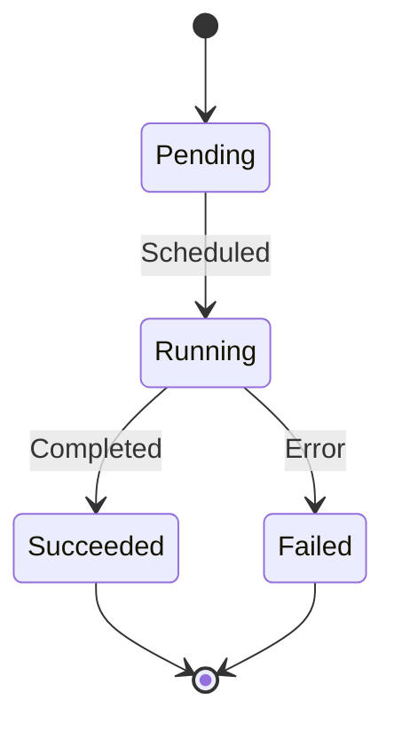

**Why Mermaid?** State diagrams are Mermaid's strength - clean, clear transitions.

---

### PlantUML: Structure and Relationships

**Visual Thinking:** "How do these components relate and interact?"

**Strengths:**
- Component boundaries and interfaces
- Architectural layers
- Deployment topology
- Class relationships and hierarchies
- Formal UML notation

**Design Questions:**
1. What are the architectural components?
2. What are the boundaries (packages, layers, nodes)?
3. What interfaces or contracts exist?
4. Is this better shown as component, deployment, class, or activity diagram?

**Example Semantic Designs:**

#### Architecture-Oriented Slide
**Slide Content:** "Device plugins transform GPUs into schedulable Kubernetes resources"

**PlantUML Design (Component emphasis):**
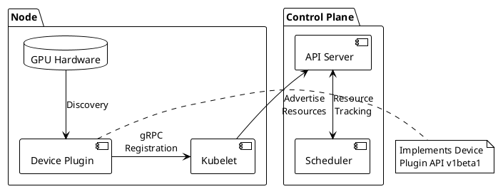

**Why PlantUML?** Shows **component boundaries**, packages, and formal relationships. Emphasizes architectural structure over flow.

#### Deployment-Oriented Slide
**Slide Content:** "GPU scheduling architecture spans worker nodes and control plane"

**PlantUML Design (Deployment emphasis):**
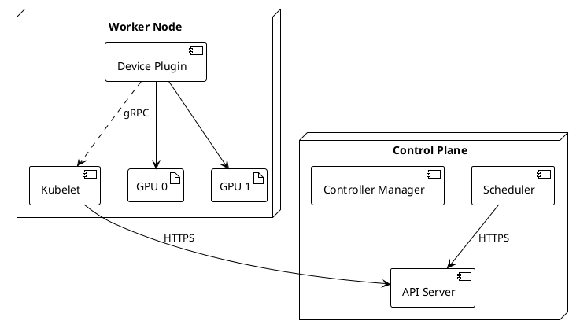

**Why PlantUML?** Deployment diagrams show **physical topology** - what runs where.

---

### Excalidraw: Spatial and Informal

**Visual Thinking:** "How can I sketch this to make it approachable and clear?"

**Strengths:**
- Hand-drawn, non-threatening aesthetic
- Flexible spatial positioning
- Annotations and callouts
- Grouping and containers
- Collaborative editing

**Design Questions:**
1. What spatial relationships matter (proximity, containment, separation)?
2. What annotations would add insight?
3. How can informal style make this more approachable?
4. What groupings or containers provide context?

**Example Semantic Designs:**

#### Conceptual Slide
**Slide Content:** "Device plugins transform GPUs into schedulable Kubernetes resources"

**Excalidraw Design (Spatial/informal emphasis):**

**Visual Layout:**
```
┌──────────────────────────────────────────────────┐
│  Worker Node (hand-drawn container)             │
│                                                  │
│  ┌────────────┐                                  │
│  │   GPU 0    │ ←─────┐                          │
│  │   GPU 1    │       │                          │
│  └────────────┘       │                          │
│                       │                          │
│  ┌───────────────────┴──────┐                    │
│  │   Device Plugin          │                    │
│  │  "Discovers & exposes"   │                    │
│  └───────────┬──────────────┘                    │
│              │ gRPC                               │
│              ↓                                    │
│  ┌────────────────────────┐                      │
│  │      Kubelet           │                      │
│  │  "Advertises capacity" │                      │
│  └────────────┬───────────┘                      │
└───────────────┼──────────────────────────────────┘
                │ HTTPS
                ↓
        ┌───────────────┐
        │   Scheduler   │ ← "Now aware of GPUs!"
        │ (Control Plane) │
        └───────────────┘
```

**Key Excalidraw Elements:**
- Hand-drawn rectangles (rough style)
- Dotted container for "Worker Node" context
- Arrow annotations ("gRPC", "HTTPS")
- Callout: "Now aware of GPUs!" with arrow
- Spatial positioning: Node container shows containment, scheduler outside shows separation

**Why Excalidraw?**
- Informal style makes architecture approachable
- Spatial positioning shows "inside node" vs "control plane"
- Annotations add narrative
- Editable for workshop/collaboration

#### Brainstorming Slide
**Slide Content:** "Multiple strategies for GPU scheduling"

**Excalidraw Design (Brainstorming emphasis):**

**Visual Layout:**
```
      GPU Scheduling Strategies
              (title)
                 │
     ┌───────────┼───────────┐
     │           │           │
     ↓           ↓           ↓
┌─────────┐ ┌─────────┐ ┌─────────┐
│ Device  │ │  MIG    │ │ Time-   │
│ Plugin  │ │ Slicing │ │ Slicing │
│ (NVIDIA)│ │(AWS/GKE)│ │(Run:ai) │
└─────────┘ └─────────┘ └─────────┘
     │           │           │
     └───────────┴───────────┘
              │
              ↓
      "Pick based on use case"
       (annotation in circle)
```

**Key Excalidraw Elements:**
- Central concept with radiating options
- Hand-drawn boxes with vendor names
- Grouping shows "all are options"
- Bottom annotation with circled callout
- Sketch style encourages discussion

**Why Excalidraw?** Brainstorming feel, non-hierarchical layout, encourages "these are options to discuss."

---

## Semantic Redesign Process

### Step 1: Analyze Slide Semantics

**Questions to ask:**
- What is the **core concept** of this slide?
- Is it about:
  - **Process/Flow?** (A→B→C progression)
  - **Structure/Architecture?** (Components and relationships)
  - **Concept/Idea?** (Abstract thinking, brainstorming)
  - **State/Lifecycle?** (Transitions and conditions)
  - **Comparison?** (Side-by-side options)

### Step 2: Match to Platform Strengths

| Slide Semantic | Best Platform | Why |
|----------------|---------------|-----|
| Process/workflow | **Mermaid flowchart** | Directional flow, clear entry/exit |
| API interactions | **Mermaid sequence** | Time-based message passing |
| System architecture | **PlantUML component** | Component boundaries, interfaces |
| Deployment topology | **PlantUML deployment** | Physical node placement |
| Class design | **PlantUML class** | Inheritance, relationships, methods |
| Brainstorming | **Excalidraw sketch** | Informal, flexible, annotatable |
| Conceptual relationships | **Excalidraw spatial** | Proximity, grouping, containers |

### Step 3: Design for Platform

**Don't think "how do I convert this?"**

**Think:**
- **Mermaid:** "What is the flow or sequence here?"
- **PlantUML:** "What are the components and their relationships?"
- **Excalidraw:** "How can I sketch this to make it clearer?"

### Step 4: Leverage Platform-Specific Features

#### Mermaid-Specific Features
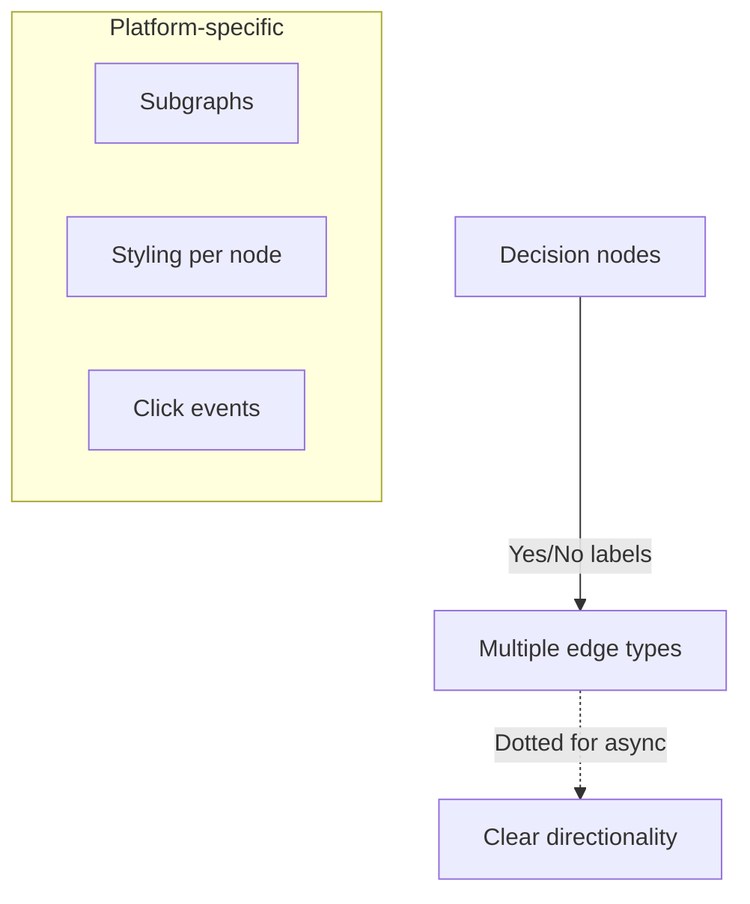

#### PlantUML-Specific Features
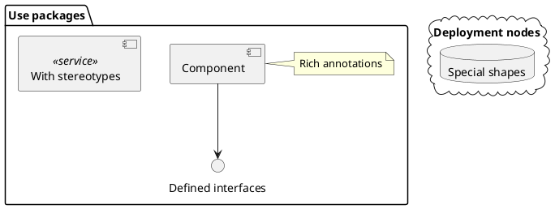

#### Excalidraw-Specific Features
- Hand-drawn aesthetic (automatic)
- Flexible positioning (pixel-perfect placement)
- Grouping (select multiple, group)
- Arrows with label attachment
- Color-coded regions
- Free-form annotations
- Editable at excalidraw.com

---

## Redraw-Diagrams: Semantic Redesign Workflow

When the user asks to "redraw diagrams," the workflow should be:

### 1. Extract and Analyze Existing Diagram

```bash
# Get slide context
SLIDE_CONTENT=$(extract slide content)
DIAGRAM_CODE=$(extract existing diagram code)
```

**Analyze semantically:**
- What concept does the slide convey?
- What is the existing diagram showing?
- What is its semantic intent (flow? structure? concept?)?

### 2. Redesign for Each Platform

**Don't convert the code. Redesign the concept.**

For a slide about "GPU Device Plugin Registration":

**Existing Mermaid (hypothetical):**
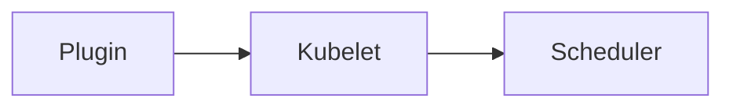

**Semantic Redesign:**

**Mermaid (Flow emphasis):**
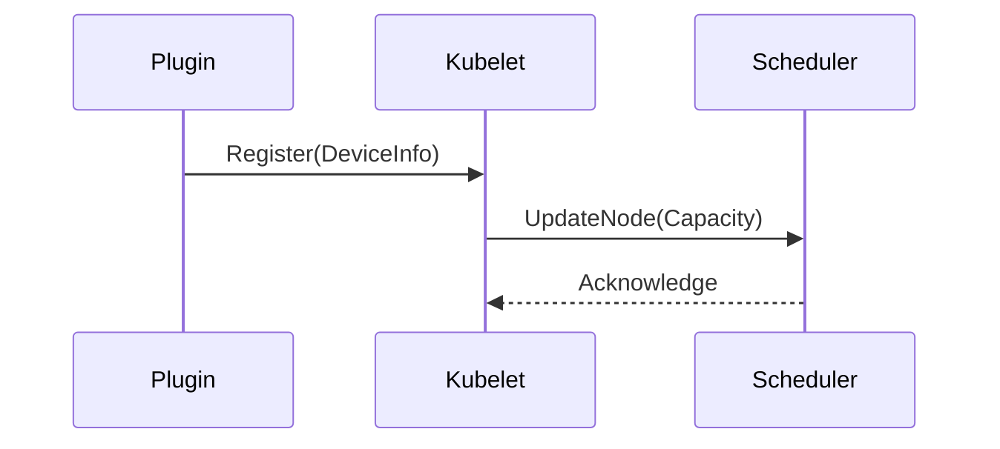
*Redesigned to show sequence of operations, not just static connections.*

**PlantUML (Architecture emphasis):**
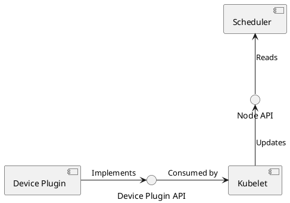
*Redesigned to show architectural relationships and interfaces.*

**Excalidraw (Spatial emphasis):**
```
[Hand-drawn layout with Plugin inside "Node" container,
Scheduler outside in "Control Plane" container,
arrows showing "Registration happens here" annotation,
"Capacity updates flow here" callout]
```
*Redesigned to show physical/logical separation and annotation.*

### 3. Generate All Formats with Semantic Designs

Each platform gets a **thoughtfully designed diagram**, not a mechanical conversion.

---

## Implementation: Multi-Platform Scripts

### Current Approach (Conversion)
```bash
# generate-multi-platform-diagram.sh
1. Save Mermaid source
2. Convert Mermaid → PlantUML (translate-diagram.js)
3. Convert Mermaid → Excalidraw (translate-diagram.js)
```

**Problem:** PlantUML and Excalidraw are "dumb conversions" that don't leverage platform strengths.

### Semantic Approach (Redesign)

When user chooses to create diagrams:

**Option 1: Mermaid Primary**
- Claude designs Mermaid diagram for slide semantics
- Mermaid saved and embedded inline
- **Other platforms optional** - offer to redesign or skip

**Option 2: PlantUML Primary**
- Claude designs PlantUML diagram for architectural slides
- PlantUML saved and rendered
- **Other platforms optional** - offer to redesign or skip

**Option 3: Excalidraw Primary**
- Claude designs Excalidraw layout for conceptual slides
- Excalidraw JSON generated with semantic positioning
- **Other platforms optional** - offer to redesign or skip

**Option 4: All Platforms (Semantic)**
- Claude analyzes slide semantics
- Designs **three different diagrams** leveraging each platform's strengths
- User gets three different visual perspectives on the same concept

---

## Examples: Same Concept, Three Platforms

### Slide: "Kubernetes Device Plugin Workflow"

#### Mermaid Design (Flow)
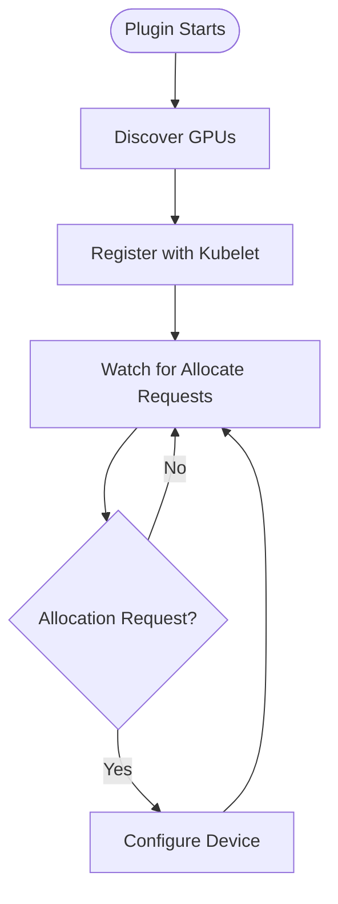
**Emphasis:** Step-by-step process flow.

#### PlantUML Design (Architecture)
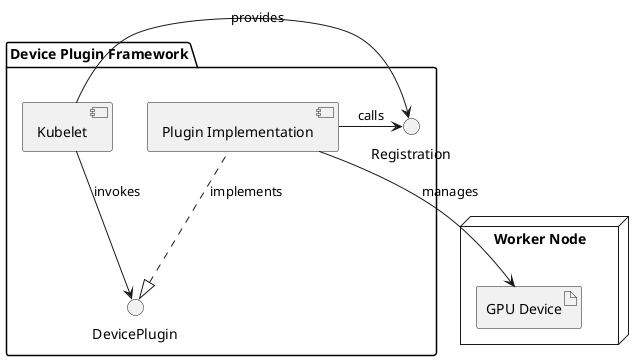
**Emphasis:** Component relationships and interfaces.

#### Excalidraw Design (Conceptual)
```
[Hand-drawn sketch showing:]

┌──────────────────────────────────────┐
│  Worker Node (container box)        │
│                                      │
│  ┌──────────┐                        │
│  │  GPU 0   │                        │
│  │  GPU 1   │  ← "Hardware"          │
│  └──────────┘                        │
│       ↑                              │
│       │ discovers                    │
│       │                              │
│  ┌────┴───────────┐                  │
│  │ Device Plugin  │ ← "Your code"    │
│  │ (your impl)    │                  │
│  └────┬───────────┘                  │
│       │                              │
│       │ registers via gRPC           │
│       ↓                              │
│  ┌──────────────┐                    │
│  │   Kubelet    │ ← "K8s agent"      │
│  │              │                    │
│  └──────────────┘                    │
└──────────────────────────────────────┘
         │
         │ reports capacity
         ↓
    ┌─────────┐
    │Scheduler│ ← "Control Plane"
    └─────────┘
```
**Emphasis:** Informal, annotated, shows "where code lives."

---

## Best Practices

### 1. Start with Slide Semantics
Always ask: "What is this slide trying to convey?" before choosing platform.

### 2. One Platform Primary
Choose the platform that best fits the slide's core concept. Embed that one inline.

### 3. Others are Optional
Generate other platforms only if they add value or user requests multi-platform export.

### 4. Redesign, Don't Convert
Each platform should get a diagram designed for its strengths, not mechanically converted.

### 5. Leverage Platform Features
- Mermaid: Use appropriate diagram type (flowchart vs sequence vs state)
- PlantUML: Use stereotypes, packages, proper UML notation
- Excalidraw: Use spatial positioning, annotations, grouping

### 6. Keep It Simple
All platforms benefit from cognitive load limits (7-9 elements max).

---

## Tool Support

### Translation Scripts (Keep for Reference)
The `translate-diagram.js` script can still be useful for:
- Quick prototyping
- Generating starting points for manual refinement
- Batch conversion when mechanical translation is acceptable

### Semantic Generation (New)
New scripts needed:
- `generate-semantic-diagram.sh` - Analyzes slide, suggests platform, generates appropriate design
- `redesign-diagram.sh` - Takes existing diagram, redesigns for different platform
- Platform-specific design templates

---

## Summary

**Old approach:** Create Mermaid, convert to PlantUML and Excalidraw.
**New approach:** Analyze slide semantics, design diagram for each platform's strengths.

**Key principle:** Each diagram platform is a different **way of thinking visually**. Use the right thinking for the right concept.

**Result:** Users get platform-appropriate diagrams that leverage each tool's unique capabilities, not lowest-common-denominator conversions.
