# Visual Design for Presentations

Effective visual design combines diagrams, images, and consistent theming to create engaging, professional, accessible presentations. Master mermaid diagrams, stock photography, AI image generation, colorblind-safe palettes, and visual cohesion.

**Evidence-based accessibility**: This skill incorporates research-based best practices for accessible visual design. See `references/presentation-best-practices.md` for full guidelines.

## Mermaid Diagrams

Mermaid provides text-based diagramming that renders beautifully in Slidev and exports well.

### Flowcharts

Best for: Processes, decision trees, workflows

**Basic syntax:**
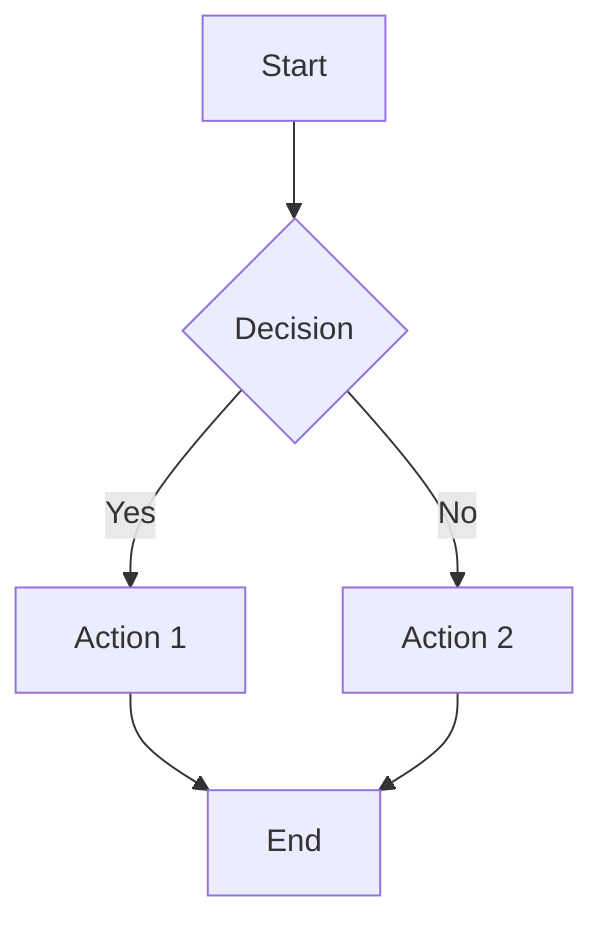

**Direction options:**
- `graph TD` - Top to bottom
- `graph LR` - Left to right
- `graph RL` - Right to left
- `graph BT` - Bottom to top

**Node shapes:**
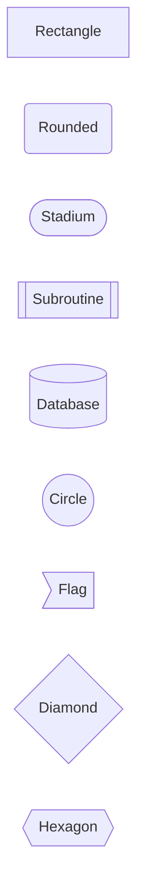

**Arrow types:**
```mermaid
graph LR
    A-->B      %% Solid arrow
    C-.->D     %% Dotted arrow
    E==>F      %% Thick arrow
    G-.-H      %% Dotted line
    I---J      %% Solid line
```

**Edge labels:**
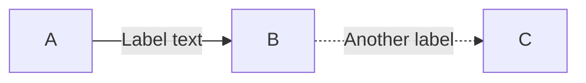

### Sequence Diagrams

Best for: API calls, interactions, communication flows

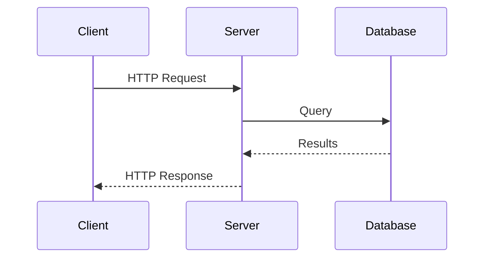

**Message types:**
- `->` Solid line
- `-->` Dotted line
- `->>` Solid arrow
- `-->>` Dotted arrow

**Activation boxes:**
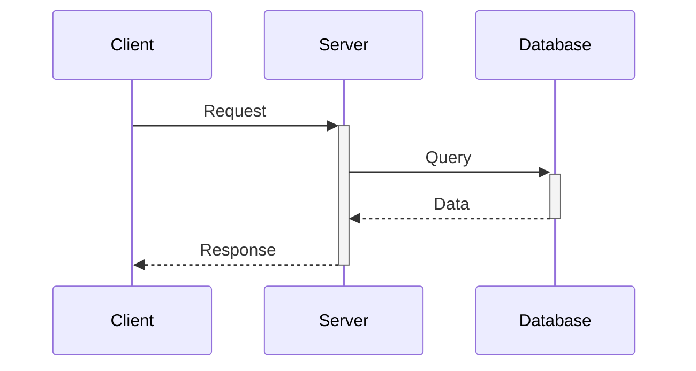

**Notes:**
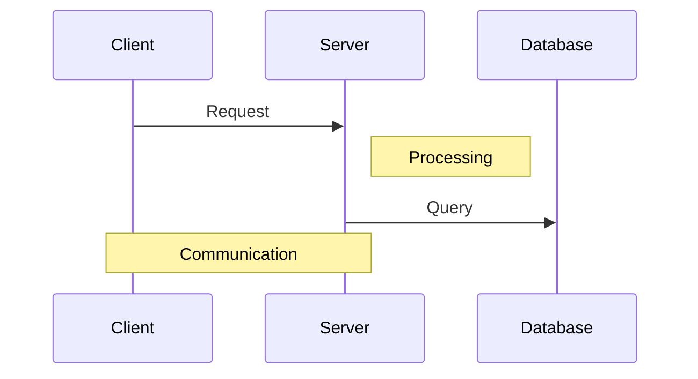

### Class Diagrams

Best for: Object-oriented design, data models, architecture

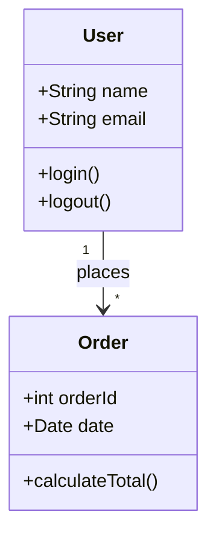

**Relationships:**
- `<|--` Inheritance
- `*--` Composition
- `o--` Aggregation
- `-->` Association
- `--` Link
- `..|>` Realization
- `..` Dependency

**Visibility:**
- `+` Public
- `-` Private
- `#` Protected
- `~` Package

### State Diagrams

Best for: State machines, lifecycle, status changes

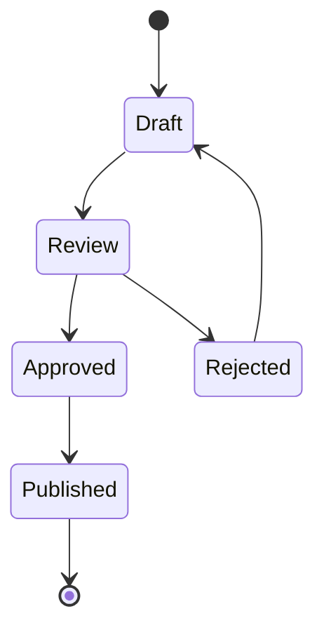

**With descriptions:**
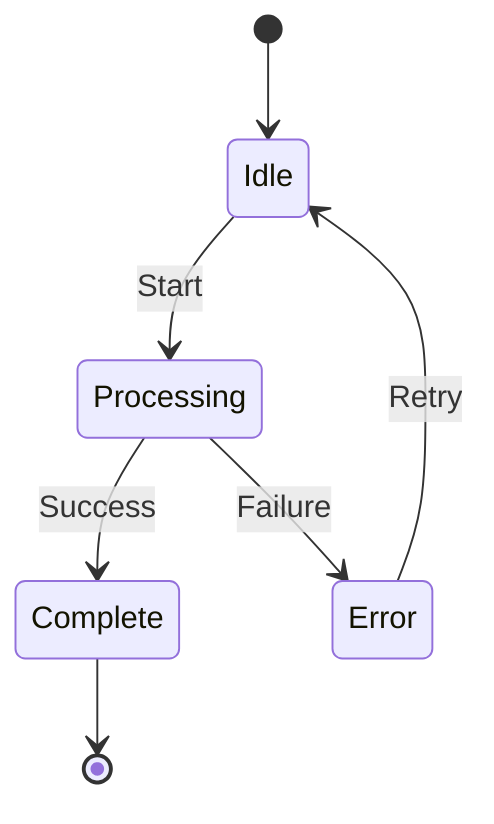

### ER Diagrams

Best for: Database schemas, data relationships

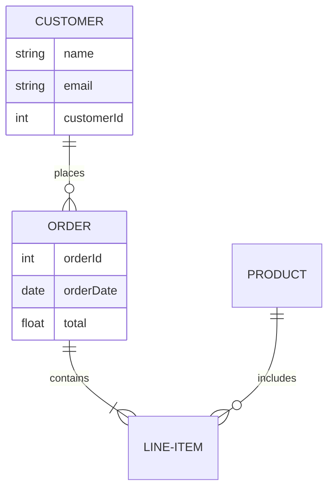

**Relationship types:**
- `||--||` One to one
- `||--o{` One to many
- `}o--o{` Many to many
- `||--o|` Zero or one

### Gantt Charts

Best for: Timelines, project schedules, roadmaps

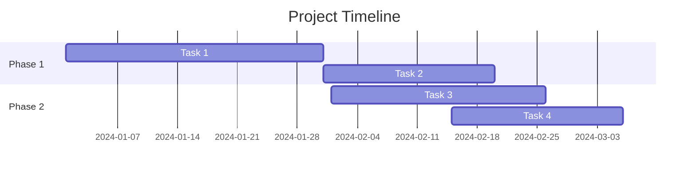

### Theming Diagrams

Apply consistent colors:

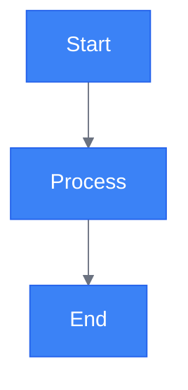

**Theme presets:**
- `default` - Standard colors
- `dark` - Dark mode
- `forest` - Green tones
- `neutral` - Grayscale
- `base` - Customizable (use themeVariables)

## Diagram Selection Guide

**Process or workflow?** → Flowchart
- Shows steps and decisions
- Linear or branching paths
- Start and end points clear

**System interaction?** → Sequence Diagram
- Shows communication between components
- Time-ordered messages
- Request/response patterns

**Data structure?** → Class or ER Diagram
- Shows entities and relationships
- Object-oriented design
- Database schema

**State changes?** → State Diagram
- Shows status transitions
- Lifecycle representation
- Finite states

**Timeline or schedule?** → Gantt Chart
- Shows tasks over time
- Dependencies and milestones
- Project planning

**Complex architecture?** → Component + Flowchart
- Multiple diagram types
- Different abstraction levels
- Layered view

## Stock Photography

### Image Selection Criteria

**Relevance:**
- Directly related to slide content
- Reinforces message
- Doesn't distract

**Quality:**
- Minimum 1920x1080 resolution
- Sharp, well-lit
- Professional composition

**Tone:**
- Matches presentation style
- Appropriate for audience
- Consistent emotional impact

**Diversity:**
- Inclusive representation
- Varied perspectives
- Authentic, not staged

### Unsplash Search Strategies

**Concept-based searches:**
- "team collaboration"
- "data visualization"
- "technology innovation"
- "business meeting"
- "cloud computing abstract"

**Color-specific searches:**
- "blue technology"
- "minimal white background"
- "dark professional"

**Orientation searches:**
- Add "landscape" for 16:9 slides
- Add "portrait" for split layouts

**Quality indicators:**
- High view count
- Professional photographer
- Editorial collection

### Pexels Alternative

Similar to Unsplash, good backup source:
- Free for commercial use
- No attribution required (but appreciated)
- Good for videos too

### Attribution

Include in presenter notes or final slide:

```markdown
<!--
Image credits:
- Photo by [Photographer Name] on Unsplash
- https://unsplash.com/photos/[photo-id]
-->
```

### Image Optimization

**Before using:**
- Resize to 1920x1080 maximum
- Compress to reduce file size
- Save in appropriate format (JPG for photos, PNG for graphics)

**Tools:**
- ImageMagick: `convert input.jpg -resize 1920x1080 output.jpg`
- Online: TinyPNG, Squoosh

## AI Image Generation

### DALL-E 3 Prompting

**Structure:**
```
[Subject] + [Style] + [Composition] + [Colors] + [Details] + [Quality]
```

**Examples:**

Technical presentation:
```
Isometric illustration of cloud infrastructure, interconnected servers
and databases, modern tech style, blue and purple gradient, clean
minimal design, high detail, professional quality
```

Business presentation:
```
Professional photograph of diverse business team in modern office,
collaborating around laptop, natural lighting, corporate environment,
blue and gray tones, shallow depth of field, high resolution
```

Data visualization:
```
Abstract data visualization, flowing connections and nodes,
information network concept, gradient from blue to cyan,
dark background, glowing elements, futuristic style, 16:9 ratio
```

**Best practices:**
- Be specific about style (photo, illustration, 3D render)
- Specify aspect ratio (16:9 for slides)
- Include lighting details for realism
- Mention color palette for consistency
- Add quality descriptors (high detail, professional)

### Midjourney Prompting

**Structure:**
```
/imagine [description] --ar 16:9 --v 6 --style [style]
```

**Examples:**

Concept illustration:
```
/imagine neural network visualization, interconnected nodes and
pathways, abstract tech concept, electric blue and cyan,
dark background, volumetric lighting --ar 16:9 --v 6 --style raw
```

Architectural diagram:
```
/imagine microservices architecture diagram, isometric view,
containerized applications, kubernetes cluster, technical illustration,
blue white color scheme, clean lines --ar 16:9 --v 6
```

**Parameters:**
- `--ar 16:9` Aspect ratio for slides
- `--v 6` Version 6 (latest)
- `--style raw` Less artistic, more literal
- `--q 2` Quality (1-2, higher = better)
- `--s 50` Stylization (0-1000, lower = literal)

### Stable Diffusion Prompting

**Positive prompt:**
```
professional business chart visualization, clean modern design,
blue gradient background, data analytics concept, high quality,
detailed, 4k resolution, trending on artstation
```

**Negative prompt:**
```
blurry, low quality, text, watermark, signature, distorted,
ugly, bad anatomy, poorly drawn
```

**Settings:**
- Steps: 30-50
- CFG Scale: 7-12
- Size: 1024x576 (16:9) or 1920x1080

### AI Image Best Practices

**Do:**
- Generate multiple variations
- Iterate on prompts
- Specify technical requirements
- Match presentation theme
- Use consistent style across slides

**Don't:**
- Use first result without review
- Mix incompatible styles
- Include text in AI images (often garbled)
- Over-complicate prompts
- Ignore licensing terms

## Visual Theme Development

### Color Palettes

**Corporate/Professional:**
```
Primary: #1e40af (Deep Blue)
Secondary: #6b7280 (Gray)
Accent: #3b82f6 (Bright Blue)
Background: #ffffff (White)
Text: #1f2937 (Dark Gray)
```

**Tech/Modern:**
```
Primary: #3b82f6 (Blue)
Secondary: #8b5cf6 (Purple)
Accent: #06b6d4 (Cyan)
Background: #0f172a (Dark Navy)
Text: #f8fafc (Light)
```

**Academic/Formal:**
```
Primary: #1e3a8a (Navy)
Secondary: #991b1b (Maroon)
Accent: #92400e (Brown)
Background: #fef3c7 (Cream)
Text: #1c1917 (Black)
```

**Creative/Energetic:**
```
Primary: #dc2626 (Red)
Secondary: #f59e0b (Amber)
Accent: #8b5cf6 (Purple)
Background: #ffffff (White)
Text: #18181b (Black)
```

### Color Theory

**Complementary:** Opposite on color wheel
- High contrast
- Energetic feel
- Use sparingly

**Analogous:** Adjacent on color wheel
- Harmonious
- Pleasing to eye
- Professional look

**Monochromatic:** Variations of single hue
- Cohesive
- Sophisticated
- Easy to execute

**Triadic:** Three equally spaced colors
- Vibrant
- Balanced
- Needs careful use

### Applying Theme Consistency

**Diagrams:** Use theme colors in all mermaid diagrams
**Images:** Apply filters or overlays to match palette
**Backgrounds:** Stick to theme backgrounds throughout
**Text:** Consistent heading and body colors
**Icons:** Single style (outline vs filled), matching colors

### Icon Systems

**Styles:**
- Outline (modern, clean)
- Filled (bold, impactful)
- Flat (minimalist)
- 3D (depth, realistic)

**Sources:**
- Heroicons (outline/filled, free)
- Feather Icons (minimalist, free)
- Font Awesome (comprehensive, free tier)
- Material Icons (Google, free)

**Consistency rules:**
- Single icon style per presentation
- Consistent size (e.g., all 24px)
- Theme-matched colors
- Same stroke weight

## Visual Composition

### Rule of Thirds

Divide slide into 3x3 grid:
- Place important elements at intersections
- Align content along grid lines
- Creates balanced, professional look

### Visual Weight

Distribute elements evenly:
- Heavy elements (images, dark colors) balance with light elements
- Symmetrical or asymmetrical balance
- Avoid one heavy corner

### Focal Point

Guide viewer's eye:
- Size: Larger elements draw attention
- Color: Bright or contrasting colors stand out
- Position: Center or rule-of-thirds points
- Isolation: White space around element

### Contrast

Create visual hierarchy:
- Light vs dark
- Large vs small
- Bold vs thin
- Color vs grayscale

## Image + Text Integration

### Text Overlays on Images

**Ensure readability:**
```markdown
---
background: './image.jpg'
class: text-center
---

<div class="backdrop-blur-sm bg-black/50 p-8">
  <h1 class="text-white text-6xl font-bold">
    Readable Title
  </h1>
</div>
```

**Techniques:**
- Dark overlay (30-70% opacity)
- Blur background behind text
- Position text in clear area
- Add drop shadow to text

### Split Layouts

**Image + text side-by-side:**
```markdown
---
layout: image-right
image: './diagram.png'
---

# Content Here

- Point 1
- Point 2
- Point 3
```

**Balance:**
- Equal visual weight on each side
- Complementary content
- Clear relationship between image and text

## Visual Hierarchy

### Size Hierarchy

```
Title (H1): 44-60pt
Subtitle (H2): 32-40pt
Section (H3): 24-32pt
Body: 18-24pt
Caption: 14-18pt
```

### Color Hierarchy

```
Primary: Headlines, key data
Secondary: Subheadings, supporting text
Tertiary: Captions, notes
Neutral: Body text, backgrounds
```

### Weight Hierarchy

```
Bold: Titles, emphasis, CTAs
Regular: Body text, most content
Light: Captions, metadata, fine print
```

## Best Practices (Evidence-Based)

### Diagrams

✅ **Do:**
- **Choose diagram type matching content** (flowchart for process, sequence for interaction)
- **Apply theme colors consistently** via mermaid init directive
- **Keep diagrams simple** (max 7-9 nodes - cognitive load research)
- **Label clearly** with readable font sizes (match slide minimum 18pt)
- **Use directional flow** (typically left-to-right or top-to-bottom)
- **Progressive disclosure** for complex diagrams (build across multiple slides)
- **Test colorblind-safe** (use patterns/shapes + color, not color alone)

❌ **Don't:**
- **Overcomplicate** with too many connections (cognitive overload)
- **Use too many colors** (stick to theme palette: 2 main + 1-2 accents)
- **Make text too small** (minimum 18pt equivalent in diagrams)
- **Create bidirectional spaghetti** (unclear flow)
- **Ignore alignment** (clean grid-based layout)
- **Rely on color alone** (add labels, patterns, icons for colorblind accessibility)

### Images

✅ **Do:**
- Use high-resolution (1920x1080+)
- Match presentation tone
- Ensure diversity and inclusion
- Provide attribution
- Optimize file size

❌ **Don't:**
- Use pixelated or blurry images
- Choose cliché stock photos
- Ignore licensing
- Use inconsistent styles
- Overload with images

### Color (Accessibility Required)

✅ **Do:**
- **Define palette upfront** (2 main colors + 1-2 accents = 3-4 total)
- **Ensure contrast ratios** (from research):
  - Normal text (<24pt): Minimum 4.5:1
  - Large text (≥24pt): Minimum 3:1
  - Test with tools: WebAIM Contrast Checker, Colorblind Web Page Filter
- **Use colorblind-safe palettes**:
  - Use ColorBrewer (colorbrewer2.org) for verified palettes
  - Common safe combinations: Blue + Orange, Purple + Green, Blue + Red
  - AVOID: Red + Green (most common colorblindness)
- **Don't rely on color alone**:
  - Add patterns in charts (stripes, dots, hatching)
  - Use labels and icons alongside colors
  - Differentiate with size/shape + color
- **Use consistently throughout** (same meaning = same color)
- **Test on different displays** (projector, laptop, mobile)

❌ **Don't:**
- **Use random colors** (establish theme palette first)
- **Rely on color alone** (excludes 8% of males with colorblindness)
- **Create low contrast** (<4.5:1 fails accessibility standards)
- **Mix too many palettes** (max 3-4 colors total)
- **Ignore accessibility** (legal requirement in many contexts)
- **Use red+green together** without additional differentiation

### Theme

✅ **Do:**
- Establish visual identity
- Apply consistently
- Create templates
- Document color codes
- Test in different contexts

❌ **Don't:**
- Change style mid-presentation
- Mix incompatible aesthetics
- Ignore brand guidelines
- Over-decorate
- Sacrifice readability for style

## Quick Reference

### Mermaid Diagram Types

```
Flowchart: graph TD
Sequence: sequenceDiagram
Class: classDiagram
State: stateDiagram-v2
ER: erDiagram
Gantt: gantt
```

### Color Palette Templates (Colorblind-Safe)

**Blue + Orange (Recommended - Universally accessible):**
```yaml
primary: "#3b82f6"      # Blue (trust, tech)
secondary: "#f97316"    # Orange (energy, action)
neutral: "#6b7280"      # Gray (backgrounds)
text: "#1f2937"         # Dark gray (body text)
background: "#ffffff"   # White (slide background)

# Contrast ratios:
# Blue on white: 8.6:1 ✓
# Orange on white: 3.4:1 (use for headings ≥24pt) ✓
# Text on white: 16.1:1 ✓
```

**Purple + Teal (Professional, modern):**
```yaml
primary: "#8b5cf6"      # Purple (creative, innovative)
secondary: "#14b8a6"    # Teal (calm, balanced)
neutral: "#64748b"      # Slate gray
text: "#0f172a"         # Near black
background: "#ffffff"   # White
```

**Dark Mode (High contrast):**
```yaml
primary: "#60a5fa"      # Light blue (readable on dark)
secondary: "#fbbf24"    # Amber (attention)
neutral: "#475569"      # Slate (dividers)
text: "#f1f5f9"         # Light gray (body text)
background: "#0f172a"   # Very dark blue

# Note: Dark mode requires ≥7:1 contrast for text
```

**Verification checklist:**
- [ ] Contrast ratios verified (4.5:1+ for normal, 3:1+ for large text)
- [ ] Tested with colorblind simulator
- [ ] Colors have distinct meaning (not red/green for pass/fail)
- [ ] Patterns/icons supplement color in charts
- [ ] Palette documented for consistency

### Image Checklist

- [ ] High resolution (1920x1080+)
- [ ] Relevant to content
- [ ] Matches presentation tone
- [ ] Properly attributed
- [ ] Optimized file size
- [ ] Accessible (alt text in notes)

---

For advanced mermaid syntax and visual design principles, consult the Mermaid documentation (https://mermaid.js.org/) and design resources like Refactoring UI.
